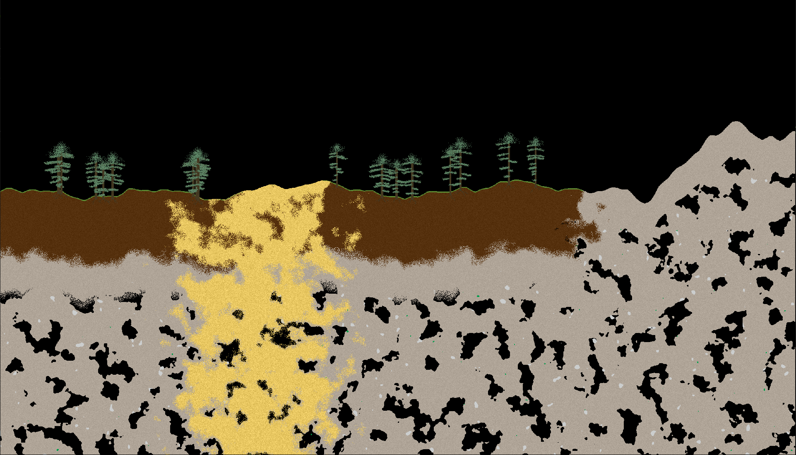
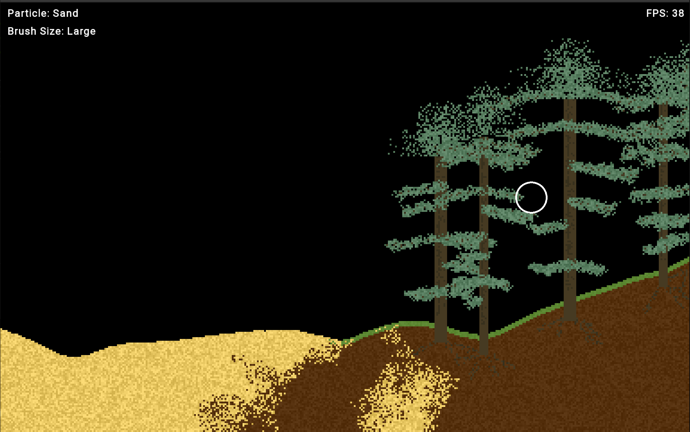
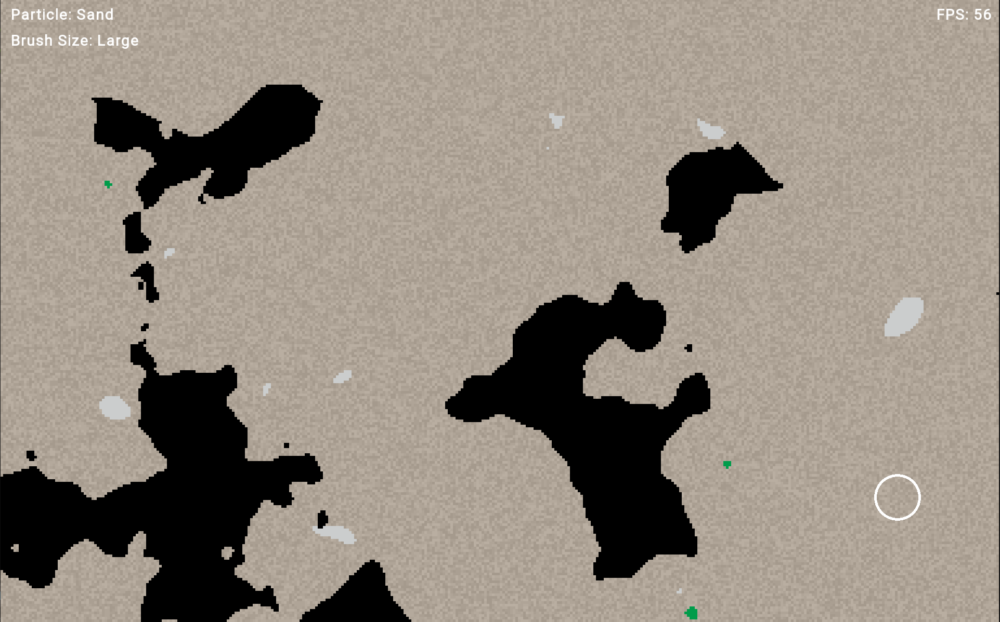

# FallingSand

A falling sand cellular automata in the style of noita and powder toy.

## Implemented Particle Types
- Sand
- Ember
- Dirt
- Grass
- Stone
- Volcanic Rock
- Obsidian
- Iron
- Fetterite
- Wood
- Bark
- Leaf
- Fire
- Water
- Lava
- Acid
- Smoke

## Implemented Biomes
- Plains
- Ocean
- Mountains
- Volcanic
- Underground
- Desert

## Images

## Features to add
- Player and Movement
- Rigidbodies
- New Particles

## Issues
- Disperse sand in water to look more natural (higher chance to swap if more dense?)
- Water doesn't spread fast enough (change direction (< 50%) instead of random dir?)
- Some materials should be destroyed by acid before others
- Code is very ugly